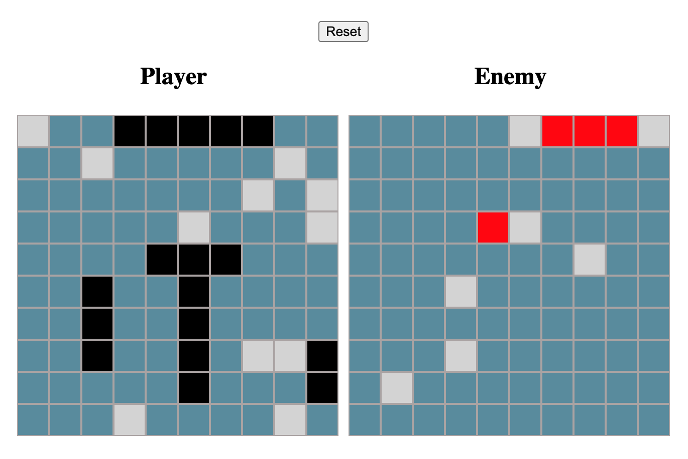

<h1 align="center">React Battleship</h1>

<h2 align="center"><a  href="https://jdonahue135.github.io/battleship/">Live Demo</a></h2>

_Click and drag to place ships, then click opponents board to play._

## Description

An app based on the board game, made to gain a better understanding of Test-Driven-Development and OOP Principles.

This project was bootstrapped with [Create React App](https://github.com/facebook/create-react-app).

## Future Scope

-HUD with game actions (ie: hit!, miss!, you sunk my battleship!). Currently uses console.log statements to show game-flow.
-Add ship icons from the board game. Currently ships are css grid squares.
